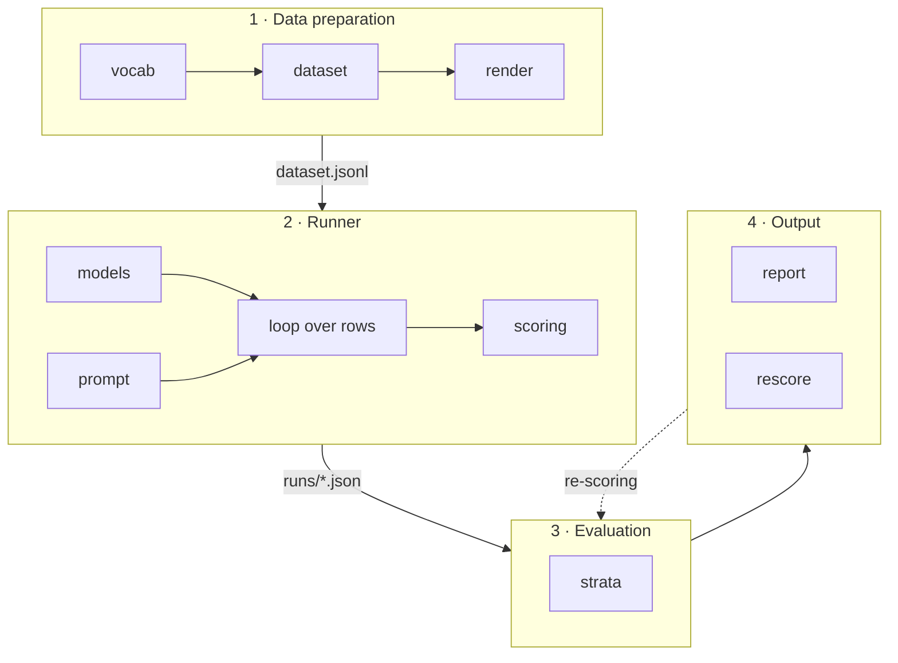

# How to measure an LLM: designing an eval harness

## Introduction

Running an LLM on an ordinary laptop is easy these days. But behind that apparent simplicity, most of the parameters that determine how well the model actually performs stay hidden. This project is an attempt to make them visible — to work out how you measure a model's work.

We will build the solution around a business case: read a pile of scanned invoices and push them into a corporate CRM. So: we have received a thick stack of paper documents, run them through a scanner, and now hold a set of rows where each row is one invoice. We need to pick a model that can read and structure that text. And we would rather not spend more than we have to — at least in relative terms.

All the code, the dataset generator and the run artifacts live here: [github.com/slv177/LLM-evaluation-and-harness](https://github.com/slv177/LLM-evaluation-and-harness). Every number in this write-up can be traced back to a specific run.

## Concepts

A few concepts are worth settling before we go further.

**A schema** is a formal description of the data structure we are willing to accept: which fields exist and what type each one is. This is the thing known as JSON Schema, or as a validator class in Pydantic. In practice you meet a schema as, say, the stated requirements for the output of a text parser. Given one, checking whether a result conforms is trivial: valid or not valid.

**A grammar** constrains which token may be generated next. It is what prevents an answer with unbalanced braces, or a string where an `Integer` was required. Under the hood it works by zeroing the probability of every token that would take the output outside the schema we declared.

A grammar comes with a trap. Its weakness is that it guarantees form, not meaning. As far as our grammar is concerned, the invoice date `1712-20-20` is perfectly acceptable: the pattern asks for four digits, then two, then two — and that is exactly what it gets. The document printed 17/12/2025, that is 17 December 2025; the model could not emit the date in its original shape, so it filled the mould with whatever digits were at hand. There is no twentieth month, but formally everything is correct.

The chain is worth memorising: we define the schema for the model's output, the server hosting the model compiles it into a grammar, and the output is then shaped by that grammar. We write the schema in code as a Pydantic class, it is converted into a JSON Schema, that goes to the server, and it reaches the model as a grammar.

**Strict and lenient accuracy** — do we treat "2 803.63" and "2803.63" as the same value or as different ones? Strictly they differ; leniently they are identical. As it turns out, some models are inclined to format values their own way, which leaves them with a high lenient score and a low strict one.

## Method

We build a pipeline that first generates the source data, then sends it to a locally running model with the parameters we want, and takes the answer back. Since the answer handler is code we wrote ourselves, we expect that after looking at the first responses we will find ways to improve it, and with it the quality of the whole pipeline. What happens at each step is spelled out below, under "Pipeline overview".

Where the business case would prepare labelled data from scanned documents, here we travel in the opposite direction for teaching purposes: during preparation we generate the ideal `output` (programmatically, from templates with a fixed seed), and then, working back from it, build the `input` string with a controlled amount of ambiguity introduced.

To evaluate the work we compare the answer against the reference field by field and take the share that matches. A match can be strict or lenient. Other parameters matter too — the full list appears below, in the section on evaluation.

The scanning step itself is left out, since it has nothing to do with the subject at hand: designing the measurement of an LLM.

The models were chosen to represent different kinds — reasoning, non-reasoning and hybrid — so that we could look at how their behaviour differs. The specific list appears below, in the section on models.

### Data

Any solution built on an LLM needs to be checked against test data. Suppose that in our business case we took the trouble to process some of those rows by hand. The result is a json file holding the value of every field we expect back from the LLM: `buyer_name`, `currency`, `due_date`, `invoice_number` and so on.

Each invoice additionally carries data that we split into two groups, `strata` and `meta`. Into `strata` goes everything we intend to account for when evaluating the model and when tuning what we feed it. We settle on three:

- the language of the invoice;
- its length — by the number of line items we sort invoices into three groups;
- `noise` — whether the scan is clean or "messy", with blurred tables, merged lines and the like.

Into `meta` go the document layout (`classic`, `compact` or `letter`) and the `seed` — what that is and why it matters, we will come to later.

For storage we choose jsonl: a text file where every line is a self-contained json document. One invoice, one line. The format is easy to append to, easy to diff, and — most importantly — easy to read line by line without loading the whole file into memory.

The `input` section of each json goes to the model; everything else is used by our own system to analyse what came back.

### Pipeline overview

The pipeline breaks into stages, each made of several modules. Here is the shape of it; the individual stages follow.

**1. Data preparation.** Runs first. Its product is the jsonl that serves as the dataset for the next stage, the runner.

- `dataset` — generating records and assembling the JSONL;
- `render` — turning a record into document text and adding noise;
- `vocab` — frozen word lists.

**2. Runner** — talks to the model.

- `models` — the model registry, the LM Studio client, and building the schema for the grammar;
- `prompt` — versioned prompts;
- `scoring` — field-by-field comparison, three outcomes, F1 over table rows.

**3. Evaluating the model's work.**

- `strata` — aggregation over slices, micro and macro, confidence intervals, regression diff.

**4. Output.**

- `report` — console and HTML;
- `rescore` — re-scoring old runs after the scorer has been fixed.

Our case uses two schemas. `Invoice` describes the invoice itself (number, date and so on). `LineItem` describes one position on it (description, quantity, unit price, amount). Both live in the `schema` module — it defines the central concepts of the project and is therefore used at nearly every stage: records are generated from it, the grammar is built from it, and the model's answer is validated against it.

### Stage 1 — data preparation

We generate records and assemble the JSONL file in the `data` directory. As described above, we produce as many "recognised" records as we need, then "mess them up" and build the `input` string for each document.

To make the pile of invoices look plausible we use "frozen word lists" — a Python file where possible counterparties, goods, locales and so on are written out as dictionaries.

So the template settles the structure of the document while the word lists fill in the values. And to make the result reproducible we fix a seed in the generator and record it in the metadata.

### Stage 2 — the runner

This is arguably the key stage of the whole process. It is organised as a loop over the rows of the dataset. The runner takes the next row, assembles a request from it, hands the request to the server, and writes the result to a file.

The request deserves a closer look. It has two parts:

- **the system prompt** — along the lines of "you extract data from invoices, return json only";
- **the user prompt** — which receives only the contents of the row's `input` field. The other fields, `expected_output` above all, must never reach the request.

Why is the system prompt mandatory? Not merely because the model would otherwise not know what to do with the incoming data. By supplying our own, we displace someone else's instructions that may be baked into the chat template — the wrapper the server puts around messages before they reach the model.

The prompt goes to a locally deployed model in LM Studio at temperature 0 with a fixed seed.

Note that the runner checks the model is already resident in memory before it sends anything. Otherwise loading time would land on the latency of the first example and shift the average across the whole sample.

The output is one JSON file per run: a header with the model, its quantisation, the prompt version, the dataset hash and the sampling parameters, plus a record for every example with per-field outcomes, token counts, latency and cost. That artifact is kept untouched, which lets us improve individual modules later and process the same data again. Within the loop, each answer is scored by the `scoring` module.

### Stage 3 — evaluating the model's work

Here we work with saved results and never return to the model. The field-by-field comparison already exists; what we assemble now are the slices.

The `strata` module groups examples along each axis (language, number of line items, noise) and by cell — that is, by combinations of all three axes at once.

We have three axes of discrete values: two languages, three sizes, noise or no noise. That gives 12 possible combinations, so we generate 120 observations, 10 per cell. This lets us not only average along an axis but look inside an individual cell. To jump ahead: that turned out to be worth doing — along the axes the picture looks reassuring, while between cells the spread is nearly two and a half times wider.

The module then computes:

- strict accuracy;
- lenient accuracy;
- the share of schema-valid answers;
- F1 by description;
- F1 by full table row;
- latency — reported as the median rather than the mean, because response times are skewed to the right and a single long document drags the mean up, distorting the picture of a typical request;
- cost;
- and always `n`, because without the sample size a number means nothing.

Why compute F1 twice? Because a missing row and a misread number in a row are different failures. The first counts a row as found when the description matches. The second requires quantity, unit price and amount to match as well, meaning the model locates both the positions and the figures in them. Why F1 at all? Because it penalises poor precision and poor recall equally.

What counts as cost? For each model we assigned a price per token in relative units. It does not correspond to any provider's dollar prices. It exists to show the relative expense of running different models and to compare their economics.

### Stage 4 — presenting the results

The last stage presents what has been computed.

The `report` module produces two renderings of the same numbers — a console table and an HTML file alongside the artifact in the `runs` folder. The format is deliberately the simplest and most portable one, so that the result opens on any laptop.

The second module of this stage, `rescore`, addresses a more general problem: the scorer is code like any other, and code has bugs. When we find and fix one, every earlier run turns out to have been measured by the wrong rule, which makes its numbers invalid.

Re-running the models is a poor answer, and not only because of GPU time. Responses are not reproducible byte for byte even at temperature 0, so fixing the rule would change the data along with it and leave us unable to say what caused the difference. That is why the raw response text is stored in the artifact from the outset: `rescore` applies the corrected rules to those very bytes and writes the result to a file marked `-rescored`. The original is left alone — an artifact is a record of what happened, not a working file.

The first such case was instructive. Its numbers come from an early probe run of sixteen examples, done at the very beginning to check whether the models differed at all, before the main dataset of 120 documents existed. The model was returning valid JSON but adding one extra closing brace at the end. The parser took the text from the first brace to the last, swallowed the extra one, and could not parse it — four flawless answers out of sixteen were recorded as unreadable, scoring zero on every field. After the parser was fixed, re-scoring took a second and lifted the run's strict accuracy from 0.75 to 1.00. What changed was not the model's performance but the quality of our instrument — and that is perhaps the main lesson of the whole stage.

### The models, and working with them

Models come in reasoning, non-reasoning and hybrid varieties. Reasoning models draft their thinking before producing an answer — they process the material before they start replying. Non-reasoning models begin answering as soon as the prompt arrives. Hybrids can do either, with the mode switched explicitly.

The models used in the experiment:

| model | size | quantisation | class |
|---|---|---|---|
| `mistralai/ministral-3-3b` | 3B | Q4_K_M | non-reasoning |
| `openai/gpt-oss-20b` | 20B | MXFP4 | reasoning |
| `Qwen3-8B` | 8B | Q4_K_S | hybrid |

We ran the tests in two decoding modes — with a grammar and without one.

A caveat about Qwen3 up front: its full run had to be stopped at example 71 of 120, because under a grammar this model never finishes reasoning and returns nothing at all. Incomplete and knowingly spoiled data does not enter the main table, so Qwen3 appears in the results as a separate single-document experiment — and that experiment turned out to be the most interesting thing in the whole project.

Our goal is to obtain the parsed invoice in a strictly defined shape, and there are two ways to get it.

The first: pass the schema in the `response_format` field, after which the server compiles it into a grammar that physically restricts the model's choice of tokens.

The second: state the same schema in words inside the prompt. That is no longer a hard requirement but a request, and the model may honour it or may not.

## Results

Every run used the same dataset (`e4f80889443e`, 120 examples), prompt v1, temperature 0 and a fixed seed.

### The main table

| model | schema delivered | strict (95 % CI) | lenient | valid | F1 descr. | F1 row | median | cost |
|---|---|---|---|---|---|---|---|---|
| gpt-oss-20b | by prompt | 0.998 (0.99–1.00) | 0.998 | 97 % | 0.977 | 0.971 | 12.2 s | 0.0833 |
| gpt-oss-20b | by grammar | 0.511 (0.48–0.55) | 0.524 | 36 % | 0.036 | 0.022 | 4.0 s | 0.0284 |
| ministral-3b | by prompt | 0.777 (0.73–0.82) | 0.920 | 22 % | 0.928 | 0.893 | 9.8 s | 0.0129 |
| ministral-3b | by grammar | 0.739 (0.71–0.77) | 0.741 | 30 % | 0.993 | 0.818 | 9.1 s | 0.0120 |

Rows are grouped by model so the difference between modes reads line by line. For gpt-oss, changing how the schema is delivered moves strict accuracy by 0.486; for ministral, by only 0.038. Meanwhile the gap between the two models at their best settings is 0.220 — half the spread found inside gpt-oss alone.

The best and the worst result in the table belong to the same model.

The share of schema-valid answers moves independently of accuracy: ministral under a grammar is valid more often (30 % against 22 %), yet it is more accurate in prompt mode.

The two F1 columns are not there for symmetry. Ministral under a grammar shows the widest gap between them in the table: 0.993 against 0.818. It finds virtually every line item but reads the figures correctly in only 82 % of them — a completely different failure from missing rows, and one that calls for a different fix. In prompt mode its gap is just 0.035.

### Breakdown of the `total` field for ministral-3b

| outcome | count |
|---|---|
| exact match | 42 of 120 |
| right value, different formatting | 70 of 120 |
| error | 8 of 120 |

The strict metric says 35 %, while the value was actually read correctly 93 % of the time.

### By document length (ministral-3b, prompt mode)

| length | line items | strict |
|---|---|---|
| short | 1–3 | 0.864 |
| medium | 4–8 | 0.734 |
| long | 9–18 | 0.734 |

The drop happens between three and four line items; beyond that the curve is flat.

### By cell (ministral-3b, prompt mode)

A cell is a combination of all three axes at once. There are twelve of them, 10 examples each.

| slice | strict |
|---|---|
| by language | de 0.762, en 0.792 |
| by length | short 0.864, medium 0.734, long 0.734 |
| by noise | clean 0.821, noisy 0.733 |
| worst cell `de/long/noisy` | 0.573 |
| best cell `de/short/noisy` | 0.891 |

Taken one axis at a time nothing looks alarming: language costs 0.03, noise 0.09, length 0.13. Between cells the spread reaches 0.32 — nearly two and a half times the widest axis. The overall figure of 0.777 describes none of these situations.

German is not the culprit, either: the best cell is German too. All four of the worst cells, however, are noisy ones.

One caveat is mandatory: a cell holds 10 examples, and the confidence interval of the worst one runs from 0.31 to 0.81. Part of that spread comes from the sample size alone, so cells tell you where to dig rather than measuring anything.

### A separate experiment: reasoning versus grammar

The same document (18 line items) and the same hybrid model, Qwen3-8B. The table holds not one experiment but three comparisons, and it should be read in pairs of rows.

| schema delivered | reasoning | budget | tokens spent | of which reasoning | finish | answer |
|---|---|---|---|---|---|---|
| by grammar | on | 2048 | 2048 (all) | 2046 | length | empty |
| by grammar | on | 6000 | 6000 (all) | 5998 | length | empty |
| by grammar | off | 2048 | 1086 | 0 | stop | present, date `0404-20-26` |
| by prompt | on | 6000 | 2534 | 1487 | stop | present, correct |

What follows from what:

- **rows 1 and 3** differ only in reasoning mode: a grammar in both, the same budget ceiling. With reasoning there is no answer at all; without it, one appears. This is the controlled comparison;
- **row 2** tests the guess that the model simply ran out of room. The budget was tripled — it burned through all of it and again returned nothing, so cramped space was not the cause;
- **row 4** shows that in prompt mode the same model with the same reasoning enabled answers correctly.

This is precisely why the full Qwen3 run was stopped: of the 71 examples processed, 42 came back empty.

## Discussion

The conclusion we arrive at is that a grammar guarantees form at the cost of content, while a schema stated in the prompt preserves content but may break form.

A sensible practical approach is to process the document with the schema described in the prompt first, then validate the result strictly. Whatever fails goes through a second pass, this time with a grammar.

### What we found along the way

The headline result: the most accurate combination is also the most expensive. Gpt-oss in prompt mode yields 0.998 at a cost of 0.0833. The cheap ministral costs 0.0129 relative units — 6.5 times less — and yields 0.777. So a 6.5-fold saving buys us 0.22 of accuracy.

But the cheap model carries a hidden cost. Only 22 % of its answers pass the schema; the rest must be repaired or re-run. At the same time its lenient accuracy is 0.920, meaning most of the discrepancies are number formatting rather than reading errors — and that is fixable with ordinary code.

The upshot: what needs comparing is not the token price but the total cost of a run including repair and manual review. Whether the saving is worth its 0.22 of accuracy depends on what it costs to check one invoice by hand.

The findings that accumulated along the way fall into groups:

**Defects in our own harness**

| № | what it was |
|---|---|
| F-001 | Without a system message of your own, the chat template supplies one written by the model's authors. It may carry irrelevant instructions, inflates token usage, and licenses the model to ask clarifying questions — all of which distorts the request. |
| F-002 | Class docstrings can leak into the schema and reach the prompt. The prompt inflates, and the model receives information about the design of the evaluation system. |
| F-003 | The schema you validate with and the schema you constrain generation with are two different documents. The first can be arbitrarily expressive because Python reads it. The second must fit within what a grammar can express. |
| F-005 | Be careful when declaring an optional field in the response schema. To the model that is permission not to return the table and to save itself the effort, whereas a human reads it as "the table will probably be there". |
| F-007 | One stray brace in the answer broke the parser, and four correct responses were recorded as unreadable. Hardening the handler against typical malformations can therefore raise measured quality. |

**Properties of the models, the data and the decoding**

| № | what it was |
|---|---|
| F-006 | A declared schema and the grammar built from it can suppress a reasoning model's work (gpt-oss here), since they leave no room to draft before answering. |
| F-008 | Decoding mode matters more than the choice of model. When designing a solution, the model's surroundings deserve no less attention than the model itself. |
| F-009 | Strict and lenient metrics can differ markedly (35 % against 93 %). In practice it may be worth relying on the lenient metric and normalising values into strict form with ordinary code. |
| F-010 | The hybrid Qwen3 with a grammar enabled may never finish reasoning within its token budget — even after raising it from 2048 to 6000 — and return nothing. Without a grammar the same model answers accurately enough. |
| F-011 | The model behaves very differently depending on the combination of conditions. The spread between cells is nearly two and a half times the spread between axes: the aggregate describes none of the actual situations. |

An eleventh finding, F-004, is mixed: the conclusion that a grammar guarantees form but not meaning surfaced together with a mistake of our own — the prompt demanded values be copied as printed while the schema demanded a fraction instead of a percentage.

The ratio is worth stating plainly: **five findings out of eleven were defects in the instrument, not properties of the models.** Which is the main lesson of the work — first you demonstrate that your instrument is sound, and only then do you say anything about models.

## Limitations

Gpt-oss in prompt mode reached 0.998 strict accuracy, with errors in only three documents out of 120. On one hand that speaks well of the model-and-prompt combination we landed on. On the other, it means another model of the same class would most likely score similarly, and on this dataset we could no longer tell them apart. In other words, at the top of the scale the instrument has hit a ceiling — a limitation of our task, not a property of the model. Two ways out: make the documents harder, or compare simpler models.

It should be said that the tests ran on generated data inside a teaching business case. In a production setting the picture may well differ.

Each of the twelve cells holds only 10 examples. Statistically that is not enough: the confidence interval in such a cell spans half the scale.

It should also be said that we measured a "model plus one prompt version" pairing. Reworking the prompt therefore opens further room to improve the pipeline.

Cost is quoted in relative units, not in any currency.

And of course, being a teaching project, it may still hold undiscovered defects. Five findings out of eleven concern the harness itself rather than the models, and it is unlikely we caught them all.
