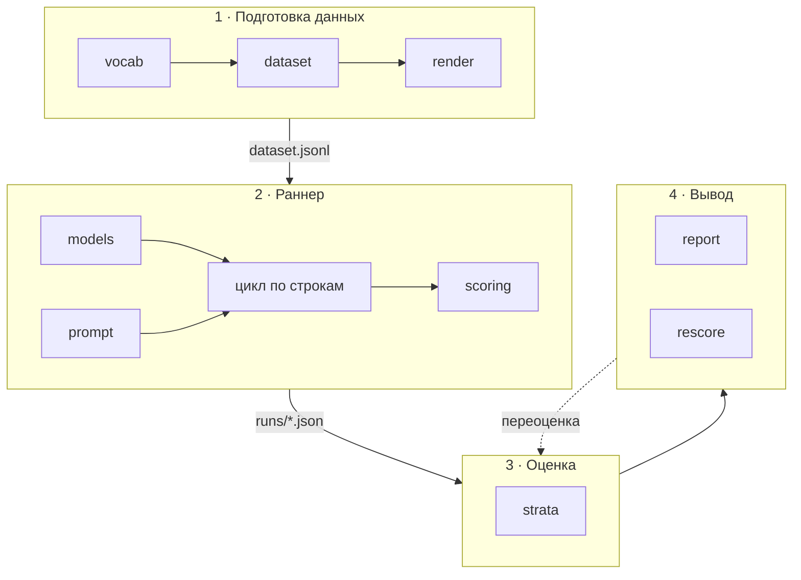

# Как измерить работу LLM: проектируем eval-харнесс

## Введение

В настоящее время запустить LLM даже на среднем ноутбуке несложно. Но при внешней простоте эксплуатации на своём оборудовании многие параметры оценки остаются скрытыми. Мы создадим проект, в котором разберёмся, как измерить работу модели.

Построим наше решение на примере такого бизнес-кейса: распознать массив сканированных счетов и внести его в корпоративную CRM. Итак, мы получили солидную пачку бумажных документов, прогнали её через сканер, и теперь у нас есть набор строк, где каждая строка соответствует одному счёту. Нам надо выбрать подходящую модель, чтобы распознавать и структурировать текст. Кроме того, желательно минимизировать расходы на эксплуатацию, хотя бы в условных единицах.

Весь код, генератор датасета и артефакты прогонов лежат здесь: [github.com/slv177/LLM-evaluation-and-harness](https://github.com/slv177/LLM-evaluation-and-harness). Каждое число в статье можно проследить до конкретного прогона.

## Концепции

Для того чтобы двигаться дальше, надо усвоить несколько концепций.

**Схема** — формальное описание структуры данных, которую мы примем для дальнейшей обработки: какие есть поля и какого они типа. Это то, что известно как JSON Schema или как класс-валидатор в библиотеке Pydantic. На практике схема встречается, например, как описание требований к результату парсинга текста. В дальнейшем мы можем легко проверить формальное соответствие результата и вынести заключение: валиден результат или нет.

**Грамматика** — ограничение того, какой следующий токен будет сгенерирован. Это, к примеру, предотвращает генерацию ответа с незакрытыми скобками, со строками вместо `Integer`. Под капотом это реализовано как обнуление вероятностей всех токенов, которые вывели бы генерируемый ответ за пределы заданной нами схемы.

У грамматики есть ловушка. Слабость её в том, что она обеспечивает форму, но не смысл. В нашем случае с точки зрения грамматики вполне допустима дата инвойса `1712-20-20`: шаблон требует четыре цифры, две и две — и получает ровно это. В документе было напечатано 17/12/2025, то есть 17 декабря 2025 года; модель не смогла выдать дату в исходном начертании и залила готовую форму теми цифрами, что были под рукой. Двадцатого месяца не существует, но формально всё правильно.

Можно запомнить связку: если мы определяем схему output модели, то грамматику строит сам сервер, где размещена модель, а output структурируется в соответствии с грамматикой. Схему мы определим в коде в виде Pydantic-класса, он будет преобразован в JSON-схему, которая будет передана на сервер и в виде грамматики попадёт в модель.

**Мягкая и строгая точность** — мы рассматриваем значения «2 803.63» и «2803.63» как одинаковые или разные? С точки зрения строгой точности это разные значения, а с точки зрения мягкой — одинаковые. Как выяснилось, некоторые модели склонны оформлять значения по-своему, и потому показывают высокий результат по мягкой точности при низком по строгой.

## Методика

Мы построим пайплайн, где сначала генерируем исходные данные, затем отправляем их на обработку в локально запущенную модель с нужными параметрами и принимаем ответ. Так как обработчик ответа — это тоже написанный нами код, мы полагаем, что после разбора первых ответов найдём способ его доработать и тем самым повысим качество работы всего пайплайна. Подробный разбор того, что происходит на каждом этапе, приведён ниже, в разделе «Обзор пайплайна».

Если в бизнес-кейсе мы готовим набор размеченных данных на основании распознанных сканов, то тут в учебных целях будем двигаться в обратном направлении: на этапе подготовки сгенерируем идеальный `output` (программно, по шаблонам с фиксированным seed), а затем, отталкиваясь от него, построим строку `input`, внеся в неё некоторое количество неясности.

Для оценки работы мы сравниваем ответ с эталоном поле за полем и получаем долю совпавших. При этом совпадение может быть строгим и мягким. К тому же надо учитывать и другие параметры результата работы — полный их список приведён ниже, в разделе про оценку.

Этап сканирования документов мы опустим, так как он не относится к обсуждаемой теме — проектированию измерения LLM.

Модели для эксперимента мы подбирали так, чтобы представить разные их типы — рассуждающие, нерассуждающие и гибридные — и посмотреть на разницу в поведении. Конкретный список приведён ниже, в разделе про модели.

### Данные

Всякое решение, построенное на LLM, нуждается в проверке его работы на тестовых данных. Предположим, что в нашем бизнес-кейсе мы не поленились и часть таких строк обработали вручную. В результате у нас появился json-файл, в котором есть значения каждого поля, которое мы ожидаем получить от LLM: `buyer_name`, `currency`, `due_date`, `invoice_number` и так далее.

Дополнительно у каждого счёта есть данные, которые мы разобьём на две группы — `strata` и `meta`. В `strata` мы положим то, что будем учитывать при оценке работы модели и при дальнейшей корректировке подачи на вход. Остановимся на трёх:

- язык счёта;
- длина счёта (по количеству позиций мы сгруппируем счета в три группы);
- `noise` — является ли скан чистым или «замусоренным», с нечёткими таблицами, слитыми строками и так далее.

В `meta` мы положим формат документа (`classic`, `compact` или `letter`) и `seed` (что это и зачем нужно, разберёмся позже).

Для хранения данных мы выберем формат jsonl — это текстовый файл, где каждая строка представляет собой отдельный json. То есть данные по каждому счёту будут соответствовать одной строке. Преимущества такого формата в том, что легко дописывать новые строки в конец файла, легко проводить diff, а главное — легко читать большие файлы построчно, не загружая их в память целиком.

Секцию json `input` мы подадим на вход модели, а остальное использует наша система для анализа результата её работы.

### Обзор пайплайна

В целом наш пайплайн можно разбить на этапы, каждый будет состоять из нескольких модулей. Сейчас познакомимся с ними обзорно, чтобы представлять общую картину, а потом обсудим каждый этап.

**1. Подготовка данных.** Выполняется в самом начале. Результатом этого этапа является тот самый jsonl, который служит датасетом для следующего этапа — раннера.

- `dataset` — порождение записей и сборка JSONL;
- `render` — превращение записи в текст документа и внесение шума;
- `vocab` — замороженные словари.

**2. Раннер** — выполняет обращение к модели.

- `models` — реестр моделей, клиент LM Studio и сборка схемы для грамматики;
- `prompt` — версионированные промпты;
- `scoring` — сравнение поле за полем, три исхода, F1 по строкам таблицы.

**3. Оценка работы модели.**

- `strata` — агрегация по срезам, micro и macro, доверительные интервалы, регрессионный дифф.

**4. Вывод.**

- `report` — консоль и HTML;
- `rescore` — переоценка старых прогонов после исправления скорера.

В нашем кейсе мы используем две схемы. Одна, `Invoice`, определяет поля собственно инвойса (номер, дата и так далее). Вторая, `LineItem`, определяет поля, относящиеся к конкретной позиции инвойса (наименование, количество, цена, сумма). Обе схемы живут в модуле `schema` — он определяет центральные понятия проекта и потому используется почти на всех этапах: по нему порождаются записи, из него строится грамматика, по нему же проверяется ответ модели.

### Этап 1 — подготовка данных

Мы порождаем записи и формируем файл JSONL в каталоге `data`. Как было описано выше, в нашем проекте мы генерируем нужное нам количество распознанных записей, а потом «засоряем» их и формируем строку `input` по каждому документу.

Для того чтобы массив счетов выглядел достоверно, мы используем «замороженные словари» — питоновский файл, где в виде словарей описаны возможные контрагенты, торговые позиции (товары), локали и так далее.

Получается, что шаблон определит структуру документа, поля будут заданы значениями из словарей. А для того чтобы результат был воспроизводим, мы задаём seed в генераторе и записываем в метаданные.

### Этап 2 — раннер

Пожалуй, это ключевой этап во всём рабочем процессе. Процесс организован как цикл по строкам датасета. Раннер берёт очередную строку, собирает из неё запрос, передаёт запрос на исполнение серверу и записывает результат в файл.

Остановимся подробнее на запросе. Он состоит из двух частей:

- **системный промпт** — вида «ты извлекаешь данные из счёта, верни только json»;
- **пользовательский промпт** — в него попадает только содержимое поля `input` обрабатываемой строки. Остальные поля, особенно `expected_output`, в запрос попадать не должны.

Почему обязателен системный промпт? Не только потому, что модель не знает, что ей делать с поступившими данными. Передавая его, мы избавляемся от чужих инструкций, которые могут быть зашиты в chat template (шаблон чата, которым сервер оборачивает сообщения перед подачей в модель).

Этот промпт отправляется на локально развёрнутую модель в LM Studio с температурой 0 и фиксированным seed.

Важно заметить, что раннер до отправки запросов проверяет, что модель уже загружена в память. С точки зрения получаемых данных это повлияло бы на латентность первого примера, а следовательно, сместило бы среднее по всей выборке.

На выходе получается один JSON-файл на прогон: шапка с моделью, квантом, версией промпта, хешем датасета и параметрами сэмплирования, и массив записей по каждому примеру с исходами по полям, токенами, латентностью и стоимостью. Этот результат сохраняется как артефакт нетронутым, и это позволит потом улучшать отдельные модули и повторно обрабатывать данные. В рамках процесса полученный ответ оценивается модулем `scoring`.

### Этап 3 — оценка работы модели

Тут мы работаем с сохранёнными результатами, к модели уже не возвращаемся. У нас уже есть сравнение поле за полем, и мы собираем срезы по стратам.

Модуль `strata` группирует наши примеры по каждой из осей (язык, количество позиций в инвойсе, шум) и по ячейкам, то есть по сочетаниям всех трёх осей сразу.

У нас есть три оси с дискретными величинами — два языка, три размера, шум есть или нет. Всего возможны 12 сочетаний этих величин. Поэтому мы генерируем 120 наблюдений, по 10 в каждой ячейке. Следовательно, мы можем не просто усреднять значения по осям, но и заглядывать в каждую отдельную ячейку. Забегая вперёд: это оказалось нелишним — по осям картина выглядит благополучной, а в ячейках разброс почти в два с половиной раза шире.

После этого модуль рассчитывает параметры:

- строгую точность;
- мягкую точность;
- долю схемно-валидных ответов;
- F1 по наименованию;
- F1 по строке таблицы;
- латентность — приводим медианную, а не среднюю: распределение времени ответа перекошено вправо, и один длинный документ утягивает среднее вверх, искажая картину типичного запроса;
- стоимость;
- и обязательно `n`, потому что без размера выборки число ничего не значит.

Почему мы считаем F1 дважды? Потому что пропуск строки и ошибка в цифрах строки — это разные ошибки. В первом случае строка считается угаданной, если совпало хотя бы наименование. Во втором — если совпали ещё и количество, цена и сумма, а значит, модель верно находит и позиции, и цифры в них. Почему именно F1? Потому что он одинаково наказывает и за precision, и за recall.

Что мы принимаем за стоимость? Для каждой модели мы задали ценник за токены в условных единицах. Этот показатель не равен ценам в долларах у какого-либо провайдера. Он нужен, чтобы показать условные расходы на работу разных моделей и сравнить их экономику.

### Этап 4 — представление результатов

На последнем этапе мы представляем рассчитанные значения.

Первый модуль `report` генерирует два представления одних и тех же чисел — таблицу в консоли и HTML рядом с артефактом в папке `runs`. Намеренно выбран самый простой и переносимый формат, чтобы с результатом можно было ознакомиться на любом ноутбуке.

Второй модуль этапа, `rescore`, решает более общую задачу: scorer — это такой же код, как любой другой, и в нём бывают ошибки. Когда мы находим и исправляем такую ошибку, все прошлые прогоны оказываются измерены по неверному правилу, а значит, их числа недействительны.

Прогонять модели заново — плохой выход, и не только из-за времени работы GPU. Ответы не воспроизводятся до байта даже при температуре 0, поэтому вместе с исправлением правила изменились бы и сами данные, и мы не смогли бы сказать, что именно повлияло на результат. Поэтому в артефакт с самого начала сохраняется сырой текст ответа модели, и `rescore` применяет исправленные правила к тем же самым байтам, складывая результат в файл с пометкой `-rescored`. Оригинал при этом не трогаем: артефакт — это запись о случившемся, а не рабочий файл.

Первый же случай оказался показательным. Числа в нём относятся к раннему пробному прогону на шестнадцати примерах — он делался в самом начале, чтобы проверить, есть ли вообще разница между моделями, ещё до сборки основного датасета из 120 документов. Модель возвращала корректный JSON, но добавляла в конце одну лишнюю закрывающую скобку. Парсер брал текст от первой скобки до последней, захватывал лишнюю и не мог его разобрать — четыре безупречных ответа из шестнадцати записались как нечитаемые с нулём по всем полям. После исправления парсера переоценка заняла секунду и подняла строгую точность прогона с 0.75 до 1.00. Изменился не результат модели, а качество нашего измерителя — и это, пожалуй, главный урок всего этапа.

### Используемые модели и работа с ними

Модели могут относиться к рассуждающим, нерассуждающим и гибридным. Рассуждающие перед выводом ответа сначала готовят черновик, то есть обрабатывают информацию до того, как начать отвечать. Нерассуждающие приступают к ответу сразу по получении промпта. Гибридные умеют работать в обоих режимах, причём режим переключается явно.

Для эксперимента мы использовали следующие модели:

| модель | размер | квантизация | класс |
|---|---|---|---|
| `mistralai/ministral-3-3b` | 3B | Q4_K_M | нерассуждающая |
| `openai/gpt-oss-20b` | 20B | MXFP4 | рассуждающая |
| `Qwen3-8B` | 8B | Q4_K_S | гибридная |

Мы прогнали тесты в двух режимах декодирования — с грамматикой и без неё.

Сразу оговоримся про Qwen3: полный прогон по нему пришлось остановить на 71 примере из 120, потому что под грамматикой эта модель не заканчивает рассуждать и возвращает пустоту. Неполные и заведомо испорченные данные в общую таблицу не попадают, поэтому в результатах Qwen3 представлен отдельным опытом на одном документе — и опыт этот оказался самым интересным во всей работе.

Наша задача — получить распознанный счёт в строго определённом виде, и у нас есть два способа этого добиться.

Первый: передать схему в поле `response_format`, после чего сервер компилирует её в грамматику, которая физически ограничивает модель в выборе токенов.

Второй: пересказать ту же схему словами в промпте — это уже не жёсткое требование, а просьба, и модель может её выполнить, а может и не выполнить.

## Результаты

Все прогоны выполнены на одном датасете (`e4f80889443e`, 120 примеров), с промптом v1, температурой 0 и фиксированным seed.

### Основная таблица

| модель | схема подана | строгая (95 % ДИ) | мягкая | валидных | F1 наимен. | F1 строки | медиана | стоимость |
|---|---|---|---|---|---|---|---|---|
| gpt-oss-20b | промптом | 0.998 (0.99–1.00) | 0.998 | 97 % | 0.977 | 0.971 | 12.2 с | 0.0833 |
| gpt-oss-20b | грамматикой | 0.511 (0.48–0.55) | 0.524 | 36 % | 0.036 | 0.022 | 4.0 с | 0.0284 |
| ministral-3b | промптом | 0.777 (0.73–0.82) | 0.920 | 22 % | 0.928 | 0.893 | 9.8 с | 0.0129 |
| ministral-3b | грамматикой | 0.739 (0.71–0.77) | 0.741 | 30 % | 0.993 | 0.818 | 9.1 с | 0.0120 |

Строки сгруппированы по моделям, поэтому разницу между режимами видно построчно. У gpt-oss смена способа подачи схемы меняет строгую точность на 0.486, у ministral — всего на 0.038. При этом разрыв между самими моделями в их лучших режимах составляет 0.220, то есть вдвое меньше, чем разброс внутри одной gpt-oss.

Лучший и худший результат всей таблицы принадлежат одной и той же модели.

Доля схемно-валидных ответов движется независимо от точности: ministral с грамматикой валиден чаще (30 % против 22 %), но точнее он в режиме промпта.

Два F1 стоят рядом не для симметрии. У ministral под грамматикой разрыв между ними самый большой в таблице: 0.993 против 0.818. Модель находит практически все позиции, но правильно читает цифры лишь в 82 % из них — это совсем другая поломка, чем пропуск строк, и чинится она иначе. В режиме промпта разрыв у него всего 0.035.

### Разбивка поля `total` у ministral-3b

| исход | количество |
|---|---|
| точное совпадение | 42 из 120 |
| верное значение, иное оформление | 70 из 120 |
| ошибка | 8 из 120 |

Строгая метрика даёт 35 %, тогда как верно прочитано 93 %.

### Срез по длине документа (ministral-3b, режим промпта)

| длина | позиций | строгая |
|---|---|---|
| короткие | 1–3 | 0.864 |
| средние | 4–8 | 0.734 |
| длинные | 9–18 | 0.734 |

Падение происходит между тремя и четырьмя позициями, дальше кривая плоская.

### Срез по ячейкам (ministral-3b, режим промпта)

Ячейка — это сочетание всех трёх осей сразу. Их двенадцать, по 10 примеров в каждой.

| срез | строгая |
|---|---|
| по языку | de 0.762, en 0.792 |
| по длине | short 0.864, medium 0.734, long 0.734 |
| по шуму | clean 0.821, noisy 0.733 |
| худшая ячейка `de/long/noisy` | 0.573 |
| лучшая ячейка `de/short/noisy` | 0.891 |

По отдельным осям ничего тревожного: язык стоит 0.03, шум 0.09, длина 0.13. А между ячейками разброс достигает 0.32, то есть почти в два с половиной раза больше самой широкой оси. Общее число 0.777 не описывает ни одну из этих ситуаций.

Немецкий при этом не виноват: лучшая ячейка тоже немецкая. Зато все четыре худшие ячейки — зашумлённые.

Оговорка обязательна: в ячейке 10 примеров, доверительный интервал худшей из них тянется от 0.31 до 0.81. Часть разброса объясняется самим размером выборки, поэтому ячейки указывают, где копать, но не измеряют.

### Отдельный опыт: рассуждение против грамматики

Один и тот же документ (18 позиций) и одна и та же гибридная модель Qwen3-8B. Таблица содержит не один опыт, а три сравнения, и читать её надо парами строк.

| схема подана | рассуждение | бюджет | израсходовано токенов | из них рассуждения | завершение | ответ |
|---|---|---|---|---|---|---|
| грамматикой | включено | 2048 | 2048 (весь) | 2046 | по лимиту | пусто |
| грамматикой | включено | 6000 | 6000 (весь) | 5998 | по лимиту | пусто |
| грамматикой | выключено | 2048 | 1086 | 0 | штатно | есть, дата `0404-20-26` |
| промптом | включено | 6000 | 2534 | 1487 | штатно | есть, верный |

Что из чего следует:

- **строки 1 и 3** различаются только режимом рассуждения: грамматика в обеих, потолок бюджета одинаковый. С рассуждением ответа нет вовсе, без рассуждения он появляется. Это и есть контролируемое сравнение;
- **строка 2** проверяет догадку, что модели просто не хватило места. Бюджет поднят втрое — она сожгла его целиком и снова вернула пустоту, значит дело не в тесноте;
- **строка 4** показывает, что в режиме промпта та же модель с тем же включённым рассуждением отвечает верно.

Именно по этой причине полный прогон Qwen3 и был остановлен: из 71 обработанного примера 42 вернулись пустыми.

## Обсуждение

В результате мы пришли к выводу, что грамматика гарантирует форму ценой содержимого, а схема, описанная в промпте, сохраняет содержимое, но может нарушить форму.

Разумный практический подход состоит в том, чтобы сначала обрабатывать документ с описанием схемы в промпте, а затем строго проверять результат. Упавшие случаи прогоняются повторно, уже с грамматикой.

### Что мы нашли за время работы

Главный вывод такой: самая точная связка оказалась и самой дорогой. Gpt-oss в режиме промпта даёт 0.998 при стоимости 0.0833. Дешёвая ministral стоит 0.0129 условных единиц — в 6.5 раза меньше — и даёт точность 0.777. То есть за экономию в 6.5 раза мы платим 0.22 точности.

Но у дешёвой модели есть скрытая цена. Схему проходят только 22 % её ответов, остальные надо чинить или прогонять заново. При этом по мягкой точности она даёт 0.920, а значит, большая часть расхождений — это оформление чисел, а не ошибки чтения, и такое чинится обычным кодом.

Итог: сравнивать надо не цену токенов, а полную стоимость прогона вместе с починкой и ручной проверкой. Стоит ли экономия своих 0.22 точности — зависит от того, во сколько обходится ручная проверка одного счёта.

По ходу работы над проектом накопились находки, и мы разбили их на группы:

**Дефекты нашего собственного стенда на этапе исследования**

| № | суть |
|---|---|
| F-001 | Без своего системного сообщения шаблон модели подставляет промпт, зашитый разработчиком. Он может содержать лишнюю информацию, раздувает потребление токенов и разрешает переспрашивать — всё это искажает запрос. |
| F-002 | Докстринги классов могут утечь в схему и попасть в промпт. Следовательно, промпт раздувается, а модель получает сведения о дизайне системы оценки. |
| F-003 | Схема для проверки ответа и схема для ограничения генерации — два разных документа. Первая может быть сколь угодно выразительной, потому что её читает питон. Вторая обязана укладываться в возможности грамматики. |
| F-005 | Нужно быть осторожным при объявлении необязательного поля в схеме ответа. Для модели это разрешение не возвращать таблицу и сэкономить усилия, тогда как человек читает такое поле как «скорее всего, таблица придёт». |
| F-007 | Лишняя скобка в ответе ломала парсер, и четыре верных ответа записались как нечитаемые. Следовательно, доработка обработчика под типичные ошибки может повысить качество распознавания. |

**Свойства моделей, данных и декодирования**

| № | суть |
|---|---|
| F-006 | Заданная схема и построенная по ней грамматика могут подавлять работу рассуждающей модели (на примере gpt-oss), так как не дают возможности набросать черновик перед ответом. |
| F-008 | Режим декодирования влияет сильнее выбора модели. При разработке решения следует уделять окружению модели не меньше внимания, чем её выбору. |
| F-009 | Строгая и мягкая метрики могут давать заметно разную точность (35 % против 93 %). Возможно, на практике стоит опираться на мягкую метрику, а приводить значения к строгому виду обычным программным кодом. |
| F-010 | Гибридная Qwen3 с включённой грамматикой может не закончить рассуждения в отведённый бюджет токенов — даже если поднять его с 2048 до 6000 — и вернуть пустоту. Она же без грамматики отвечает достаточно точно. |
| F-011 | Модель ведёт себя очень по-разному в зависимости от сочетания условий. Разброс между ячейками почти в два с половиной раза больше, чем между осями, — агрегат не описывает ни одну из ситуаций. |

Одиннадцатая находка, F-004, смешанная: вывод о том, что грамматика гарантирует форму, но не смысл, обнаружился одновременно с нашей же ошибкой — промпт требовал копировать значения как напечатано, а схема требовала долю вместо процентов.

Соотношение стоит проговорить: **пять находок из одиннадцати оказались дефектами измерителя, а не свойствами моделей**. Отсюда и главный вывод всей работы — сначала доказываешь, что измеритель исправен, и только потом говоришь что-либо о моделях.

## Ограничения

Модель gpt-oss в режиме промпта дала строгую точность 0.998: ошибки нашлись всего в трёх документах из 120. С одной стороны, это хорошо характеризует найденное сочетание модели и промпта. С другой — это значит, что другая модель того же класса, скорее всего, покажет сходный результат, и на таком датасете мы уже не сможем их различить. Иначе говоря, наверху шкалы измеритель упёрся в потолок, и это ограничение нашей задачи, а не свойство модели. Отсюда два пути: усложнять документы или сравнивать модели попроще.

Важно отметить, что наши тесты работали со сгенерированными данными в учебном бизнес-кейсе. Возможно, в производственной среде картина окажется иной.

Каждая из двенадцати ячеек включает только 10 примеров. С точки зрения статистики этого недостаточно: доверительный интервал в такой ячейке достигает половины шкалы.

Следует также отметить, что мы измеряли работу связки «модель плюс одна версия промпта». Значит, доработка промпта открывает дополнительные возможности улучшить пайплайн.

Мы приводим стоимость в условных единицах, не в какой-либо валюте.

И конечно, как учебный проект, он может сохранять нераскрытые дефекты. Пять из одиннадцати находок относятся к самому стенду, а не к моделям, и вряд ли мы выявили все.